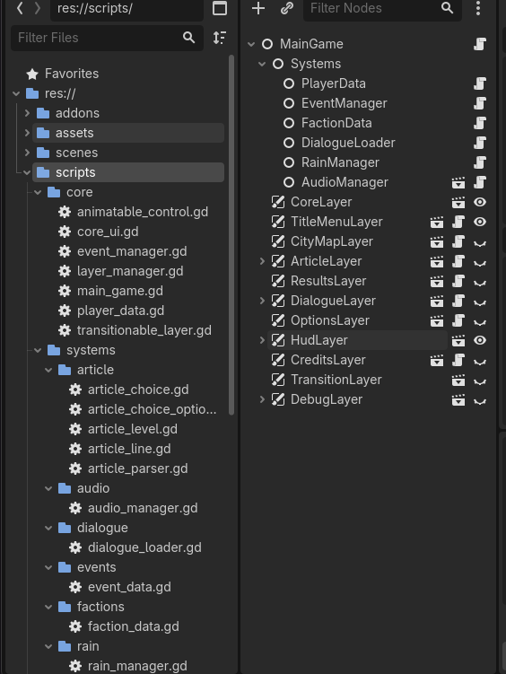

*Closed Eyes* was created for Juniper Dev's [Very Serious Game Jam](https://itch.io/jam/theveryseriousjuniperdevgamejam) in a little under a week. I did the majority of the programming for this game and created all of the UI and menus. I worked with a writer who wrote all the articles and cutscenes for the game, and an artist who created the logo and background artwork. I also produced the music for the game and added the sound effects to the game!

## Project Structure



I wanted to go for a highly organized project structure for this project. Each script folder fills a specific module of the project, and each layer in the scene tree fulfills a specific visual element of the game that needs to be displayed. This allows for a highly effecient workflow and makes it easy to find a particular feature of the project. I will be taking ideas from this setup into every future game I make as it makes debugging and inter-component cooperation very simple and streamlined.

## Article System

For this game jam, I created the article system, and handed off the story responsibilites to our writer Brandon. I wanted to amke the system easily readable and editable so that he could create lots and lots of articles quickly and with ease before our game jam time was up. This is what an article looks like in plain-text format before it is loaded into the game:

```
#real-event
A super real article not made by your boss for explaining purposes.

#desired-perception-boss
You can figure this out! The job isn't too hard, right?

#header
Bunny Restoration Efforts Lead to a Rise in Pet Ownership

#body
After the peaceful Bunny Protest of last week, the small fluffy creature is now
 [in the public's eye as a pet option (0,0,0,0,0) /
selling out in pet stores city-wide (0,0,0,0,0)].
```

A set of brackets denotes a span of text that can be clicked and "spinned" to adjust the wording. The numbers after each choice represent the reputation changes for each faction in the game if an article with that choice is submitted to the newspaper.

## Future Plans

All of us plan to pick up and finish this game at a later date, because we only wrote the game up until halfway through Act 2, and there are many features we would like to fix up, including:
- More details about all the factions that you can browse through in some sort of handbook
- More in-depth tutorial
- Backgrounds and music specific to the cutscene
- Character portrait support in cutscenes