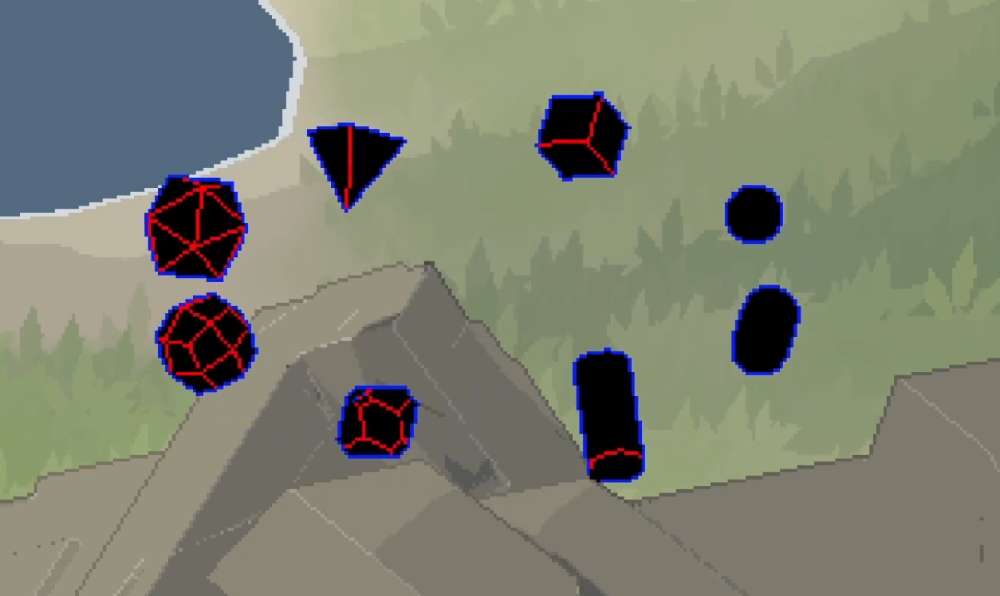
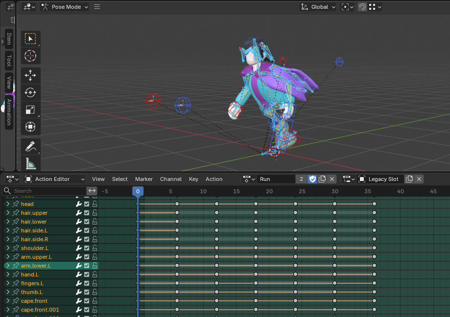

Infinity Realm: Expedition is an early prototype of a game idea I have had for a very long time. It combines 3D rendering with pixelation shaders to create a very unique visual look. 

## 3D designed to look 2D

<video width="750" height="420" controls>
  <source src="perspective.mp4" type="video/mp4">
</video>

This game is intentionally designed to look like a pixel art game, while being completely 3-dimensional behind the hood! The graphics take inspirations from games such as Dead Cells which render 3D sprites into pixelated retro-looking sprites. Having everything in 3d is actually somewhat advantageous for development; it allows me to reuse the same animation keyframes for several different types of weapons, and reuse them for all 8 angles. THe alternative would be drawing all of these pixel art sprites by hand! There is also capability for introducing trippy 3d effects later in the game, tying in with the game's planned story and how there is an omniscient higher-dimensional being watching over the main player and guiding them on their journey (yes, this is you, the player).

## Terrain System

<video width="750" height="420" controls>
  <source src="terrain-editor.mp4" type="video/mp4">
</video>
<video width="750" height="420" controls>
  <source src="terrain-painting.mp4" type="video/mp4">
</video>

This game also has its own custom-built marching squares terrain system, to allow for rapid terrain generation for this game's huge worlds to explore. This allows me to simply paint onto the terrain, and then the mouse can be used to drag the terrain up/down to adjust its height. There are many useful features in my implementation, such as weighted brushes, custom chunk management, texture/color painting, and more. It uses an implementation of Marching Squares to generate the 3d geometry for each cell in parallel, allowing the terrain to generate very quickly and utilize multithreading. There are over 25 cases the code uses to determine what exact geometry to place, with adjustable parameters such as terrace top/bottom width, wall angle, and more, allowing me to highly customize the look and feel. Shaders using noise textures are also utilized to give the terrain more variation, and a grass particle scattering algorithm is used to place grass on the terrain if it is not too close to the top or bottom ledge of a terrace.

Ever since this project was put on hold towards the start of 2025 in order to focus more on school, another developer, Yuugen, has pixked up this terrain implementation and made a [full Godot plugin](https://github.com/ToumaKamijou/Yugens-Terrain-Authoring-Toolkit) out of it. As of writing, this addon has over 600 stars on GitHub!

## Shaders

<video width="750" height="420" controls>
  <source src="combat.mp4" type="video/mp4">
</video>

A huge inspiration for the visual aesthetics of this project is the work of [tessel8r](https://www.youtube.com/@t3ssel8r/videos), who posts videos featuring his implementation of 3d pixel-art graphics. His style features highly stylized pixel art outlines and other techniques to make 3d pixel art look beautiful.

Voyage's video tutorial, ["Creating Pixel Perfect Outlines for 3D Pixel Art"](https://www.youtube.com/watch?v=LRDpEnpWohM&t=2s), explains a lot of this process and has some helpful visuals. I adapted some of the same Unity code and figured out how to get a similar setup working in Godot, using a full-screen shader that reads the screen's color, depth and normal textures, and uses that data to construct the final images that contains crisp pixel-perfect outlines overlayed over the image.

<!-- 
<video width="750" height="420" controls>
  <source src="cutout.mp4" type="video/mp4">
</video>

There are some other useful effects I have achieved via shaders, including cutouts when the character is obstructed (shown above), wind effects, lighting effects, and more. 
-->

## Animations

<video width="750" height="420" controls>
  <source src="animations.mp4" type="video/mp4">
</video>

I designed the animations to appear like pixel-art animations. Each keyframe of the animation has its interpolation mode set to Constant, meaning there is no in-between interpolation of each vertex. These keyframes are also far enough apart to where there are only about 15-20 visible frames per second in each animation. This mimics how frame-by-frame pixel animations look, but maintains the 3D geometry behind the hood.

To make animation easier, the Blender rig is also set up with IK (Inverse Kinematics), meaning I only have to move the target hand/food positions and the controls that point the elbows/knees, and inverse kinematics will take care of the rest by calculating the expected way the limb moves to achieve that target position. Other simpler joints like the head/neck and the spine are still manually rotated.