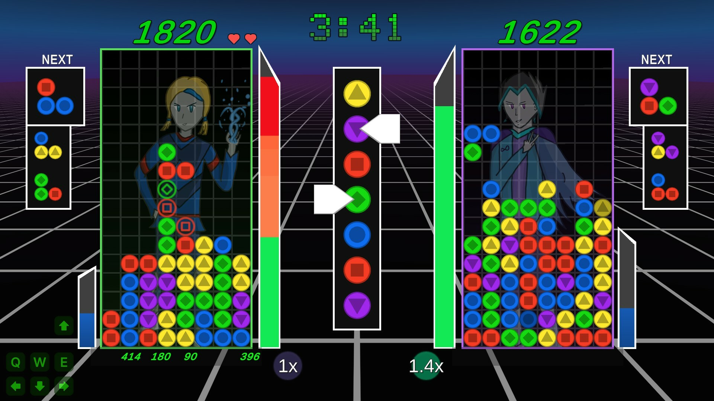
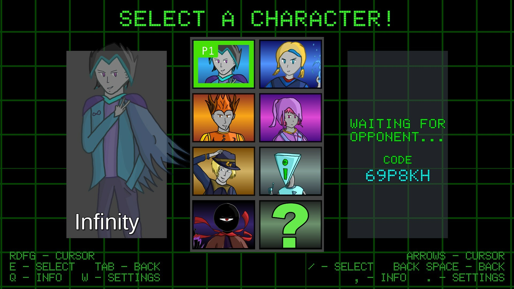
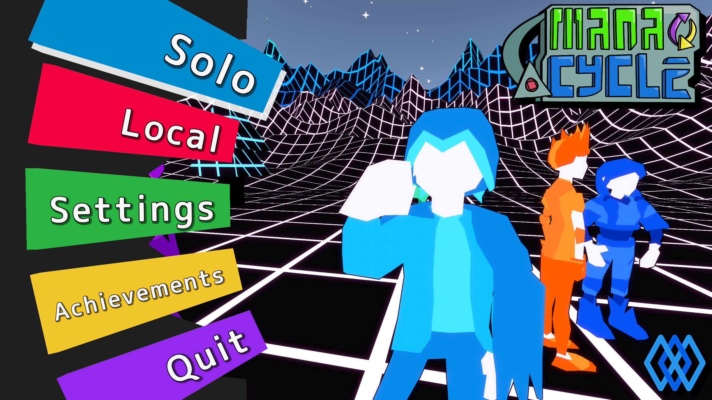
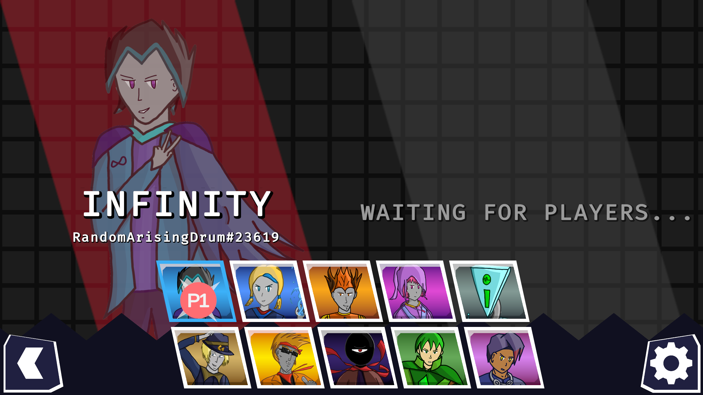
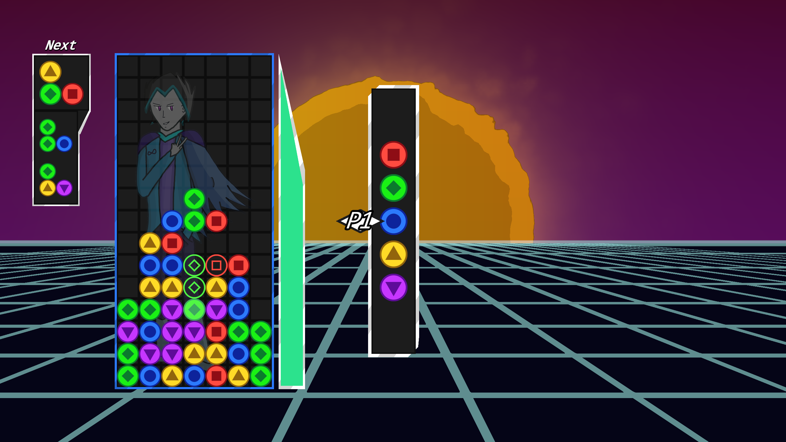

*Mana Cycle* is a puzzle multiplayer game created Technology Student Association's High School Video Game competition starting in February 2022. It was developed by myself, Justin Alvey, and Morgan Johnson. 

Mana Cycle was presented at the Missouri TSA convention in April 2023 and recieved first place.

Here are some aspects of the game I developed:
- Everything to do with the mana board, including piece placement onto the board, spellcast clearing, etc.
- Computer-opponent AI
- Abilities for each character
- Online multiplayer (incomplete, but working) (Unity's Netcode for GameObjects)
- Online leaderboards (LootLocker backend)
- Achievements (Steam API)
- Cloud saves (Steam API)

Our team continued working on the game even after the competition was over. We published the game on Steam in July 2024 and it receives occasional updates, having gotten many new characters added since its initial roster of 7, as well as many Steam API integrations for leaderboards, achievements, and save data synchronization.

I also created the home screen's 3D models. This menu was inspired by Persona 5's main menu, which also features a minimalist silhouette of each character. These models are rigged so that their pose can be adjusted easily to get the feel of the menu just right. This was also my first time delving into shaders; I made a grid shader for the wireframe terrain mountains and the skybox, and used a particle system to create the starry sky. A Cinemachine camera is used to smoothly move between the different menu targets when different menu items are hovered by the player, the same way it does in Persona 5.

We even started a [Mana Cycle 2](https://jackachulian.itch.io/mana-cycle-2?secret=BExJNQMibmRV85Hc2nb7Af5Qqz8) prototype which was much more focused on online multiplayer, and there is a working online prototype of the game. Development of this game didn't go very far as the team disbanded early on, but it was fun and interesting to learn how to properly handle online game connections, handle game lobbies through Unity's lobby system, work with Unity's Relay system, send RPCs to synchronize data, and much more.